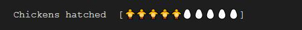

# Text Progress Bars for Obsidian

[](https://github.com/michaeladams/obsidian-text-progress-bar/releases/latest)
[](https://github.com/michaeladams/obsidian-text-progress-bar/actions/workflows/test.yml)

Adds text-based and emoji progress bars to Obsidian.

## Usage

To create a progress bar, start a code block with "text-progress-bar".

A minimal bar contains the bars label, how much is complete, and the total number.

Defaults will be taken from the plugin settings.

~~~
```text-progress-bar
Books read:1/10
```
~~~


Optionally, all the settings can be specified:

~~~
```text-progress-bar
Books read:5/10
transition:|
fill:▓
empty: 
prefix:[
suffix:]
length:10
```
~~~


Note that empty has "` `" - a special empty character.

Want emojis?  We got em:

~~~
```text-progress-bar
Chickens hatched:5/10
fill:🐥
empty:🥚
prefix:[
suffix:]
length:10
```
~~~



Specify a transition to display a character for partial completion:

~~~
```text-progress-bar
Thats no moon:10/20
transition: 🌘,🌗,🌔
fill:🌕
empty:🌑
prefix:[
suffix:]
length:3
```
~~~


And use decimal numbers to specify the partial completion of emojis

~~~
```text-progress-bar
Books read:5.5/10
transition:📖
fill:📗
empty:📕
length:10
```
~~~

Or use ASCII characters for the transition:
~~~
```text-progress-bar
Books read:5/10
transition:⣦
fill:⣿
empty:⣀
prefix:⎸
suffix:⎹
length:3
```
~~~


## Installation

The plugin can be installed manually:

1. Download the latest release
2. Extract the contents into your ./obsidian/plugins/ folder
3. Reload Obsidian
4. Enable the plugin from your settings
